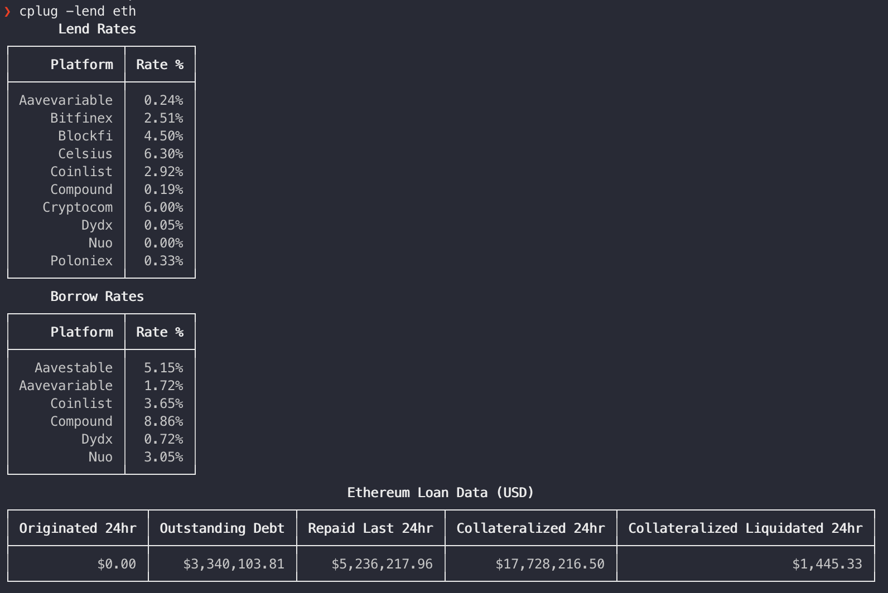

# Crypto Plug 🔌
##### cPlug is an advanced crypto market data provider via the command line. Once initialized, cplug has a set of cli arguments that will be available for use allowing end-users to fetch specific data about a cryptocurrency.

> All Data is sourced from Messari.io and will require a user-generated Messari API Key
### How to Install
You need to install [Node.js](https://nodejs.org/en/download/) first, then install the tool globally using npm via this command:
```zsh
$ npm install -g cplug
```
This will install `cplug` globally, so it will be added automatically to your PATH.

### How to Initialize
In order to enable the market data cli commands, `cplug` must be initialized using a Messari API Key. Run the following:
```zsh
$ cplug --init <api_key>
```

### Create Messari API Key
It takes 1 minute to create a Messari API key by doing the following:
1. Navigate to [messari.io](https://messari.io/)
2. Login (or sign up if you don't have an account - we will only be using it to generate an API Key)
3. Navigate to `Account` via the avatar on the top right of the navigation bar
4. Select `Manage API Key` at the bottom of the `Account Overview` page

5. Select `Create New API Key` on the API Key section which will generate and display a new API Key

6. Copy the API Key and use it in `How To Initialize`

> The API key being displayed above is invalid and will not work for you :)

### Available Commands
You can also try the help command yourself to see the available commands
```
Usage: cplug [options]

Cryptocurrency market data at your fingertips.

Options:
  -a --asset <ticker>               Get asset profile
  -md --market_data <ticker...>     Get asset(s) market data
  -ath --all_time_high <ticker...>  Get asset(s) all time high data
  -lend --lending <ticker>          Get lender/borrower rates and general defi data
  -chain --blockchain <ticker>      Get information about the blockchain
  -roi --roi <ticker>               Get ROI numbers
  -dev --developers <ticker>        Get GitHub repository data
  -news --news [ticker]             Get current Messari news (ticker optional)
  -sat --satoshi                    Get satoshi's net worth
  -i, --init <api_key>              Enter Messari API Key
  -h, --help                        Display help for more commands
```

Try them for yourself.

### Examples
Get asset profile `-a --asset`


Get current Messari news for asset `-news --news`


Get asset market data `-md --market_data`


Get all time high data `-ath --all_time_high`


Get lender/borrower rates and general lending data `-lend --lending`


Get information about the blockchain `-chain --blockchain`


Get satoshi's net worth `-sat --satoshi`


### What's Next?
- [ ] Add up and down arrows to +/- columns to indicate movement direction
- [ ] `--lending` Display lending/borrowing tables next to each other
- [ ] Consolidate config access to a single file
- [ ] Add color on a per column basis (limitation on current table lib)
